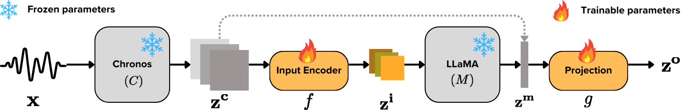

# Beyond Prompting: Time2Lang – Bridging Time-Series Foundation Models and Large Language Models for Health Sensing

:rocket: Checkout the paper [here](https://arxiv.org/abs/2502.07608)

## :book: Summary
Large language models (LLMs) show promise for health applications when combined with behavioral sensing data. Traditional approaches
convert sensor data into text prompts, but this process is prone to errors, computationally expensive, and requires domain expertise. These challenges are particularly acute when processing extended time series data. While time series foundation models (TFMs) have recently emerged as powerful tools for learning representations from temporal data, bridging TFMs and LLMs remains challenging. Here, we present Time2Lang, a framework that directly maps TFM outputs to LLM representations without intermediate text conversion. Our approach first trains on synthetic data using periodicity prediction as a pretext task, followed by evaluation on mental health classification tasks. We validate Time2Lang on two longitudinal wearable and mobile sensing datasets: daily depression prediction using step count data (17,251 days from 256 participants) and flourishing classification based on conversation duration (46 participants over 10 weeks). Time2Lang maintains near constant inference times regardless of input length, unlike traditional prompting methods. The generated embeddings preserve essential time-series characteristics such as auto-correlation. Our results demonstrate
that TFMs and LLMs can be effectively integrated while minimizing information loss and enabling performance transfer across these distinct modeling paradigms. To our knowledge, we are the first to integrate a TFM and an LLM for health, thus establishing a foundation for future research combining general-purpose large models for complex healthcare tasks.

<div align="center">
  
</div>

## How to use 

**Installation**

**Training**

``` 
python train.py --gpu 2 --batch_size 16 --epochs 10 --save_dir "save_models" --model_name "time2lang" 
```

**Feature Extraction**

To

## Citation

If you use models, code, or ideas from the project, please cite our [paper](https://arxiv.org/abs/2502.07608).

```
@article{pillai2025beyond,
  title={Beyond Prompting: Time2Lang--Bridging Time-Series Foundation Models and Large Language Models for Health Sensing},
  author={Pillai, Arvind and Spathis, Dimitris and Nepal, Subigya and Collins, Amanda C and Mackin, Daniel M and Heinz, Michael V and Griffin, Tess Z and Jacobson, Nicholas C and Campbell, Andrew},
  journal={arXiv preprint arXiv:2502.07608},
  year={2025}
}
```